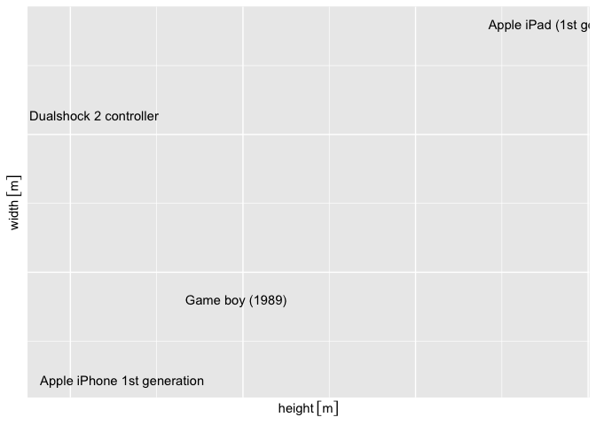
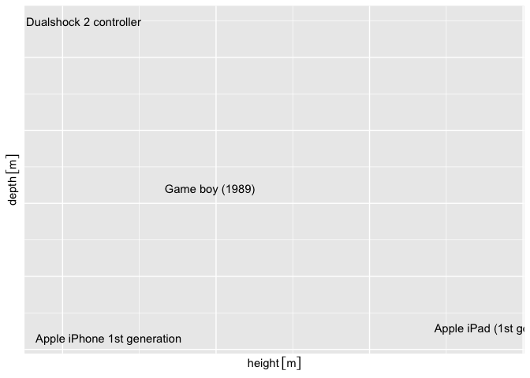

<!-- README.md is generated from README.Rmd. Please edit that file -->

# everydaysizes

<!-- badges: start -->

<!-- badges: end -->

The goal of {everydaysizes} is to give you a set of every day items with
their dimensions.

## Installation

You can not yet install the released version of everydaysizes from
[CRAN](https://CRAN.R-project.org) with:

``` r
#install.packages("everydaysizes")
```

And the development version from [GitHub](https://github.com/) with:

``` r
# install.packages("devtools")
devtools::install_github("RMHogervorst/everydaysizes")
```

## Example

This is a basic example which shows you what is in the package. The
Package at this moment contains 2 datasets with objects and their
dimensions in units.

``` r
library(everydaysizes)
library(units)
#> udunits system database from /Library/Frameworks/R.framework/Versions/3.6/Resources/library/units/share/udunits
tail(everyday_items, 4)
#>                           what    height      width      depth   type
#> 16 Apple iPhone 1st generation 0.115 [m]  0.061 [m] 0.0116 [m] device
#> 17   Apple iPad (1st gen) 2010 0.243 [m]  0.190 [m] 0.0130 [m] device
#> 18                  Blue whale 4.880 [m] 32.000 [m]     NA [m] animal
#> 19                 Sperm whale 3.350 [m] 19.000 [m]     NA [m] animal
```

``` r
library(tidyverse)
#> ── Attaching packages ─────────────────────────────────────────────────────────────── tidyverse 1.3.0 ──
#> ✓ ggplot2 3.3.0     ✓ purrr   0.3.4
#> ✓ tibble  3.0.1     ✓ dplyr   0.8.5
#> ✓ tidyr   1.0.2     ✓ stringr 1.4.0
#> ✓ readr   1.3.1     ✓ forcats 0.5.0
#> ── Conflicts ────────────────────────────────────────────────────────────────── tidyverse_conflicts() ──
#> x dplyr::filter() masks stats::filter()
#> x dplyr::lag()    masks stats::lag()
library(ggforce)
(devices <- 
  everyday_items %>% 
  filter(type == "device") )
#>                                    what    height     width      depth   type
#> 1                       Game boy (1989) 0.148 [m] 0.090 [m] 0.0320 [m] device
#> 2 Playstation 2, Dualshock 2 controller 0.095 [m] 0.157 [m] 0.0549 [m] device
#> 3           Apple iPhone 1st generation 0.115 [m] 0.061 [m] 0.0116 [m] device
#> 4             Apple iPad (1st gen) 2010 0.243 [m] 0.190 [m] 0.0130 [m] device
```

``` r
ggplot(devices, aes(height, width, label = what)) +
  geom_text()
```



``` r
ggplot(devices, aes(height, depth, label = what)) +
  geom_text()
```


